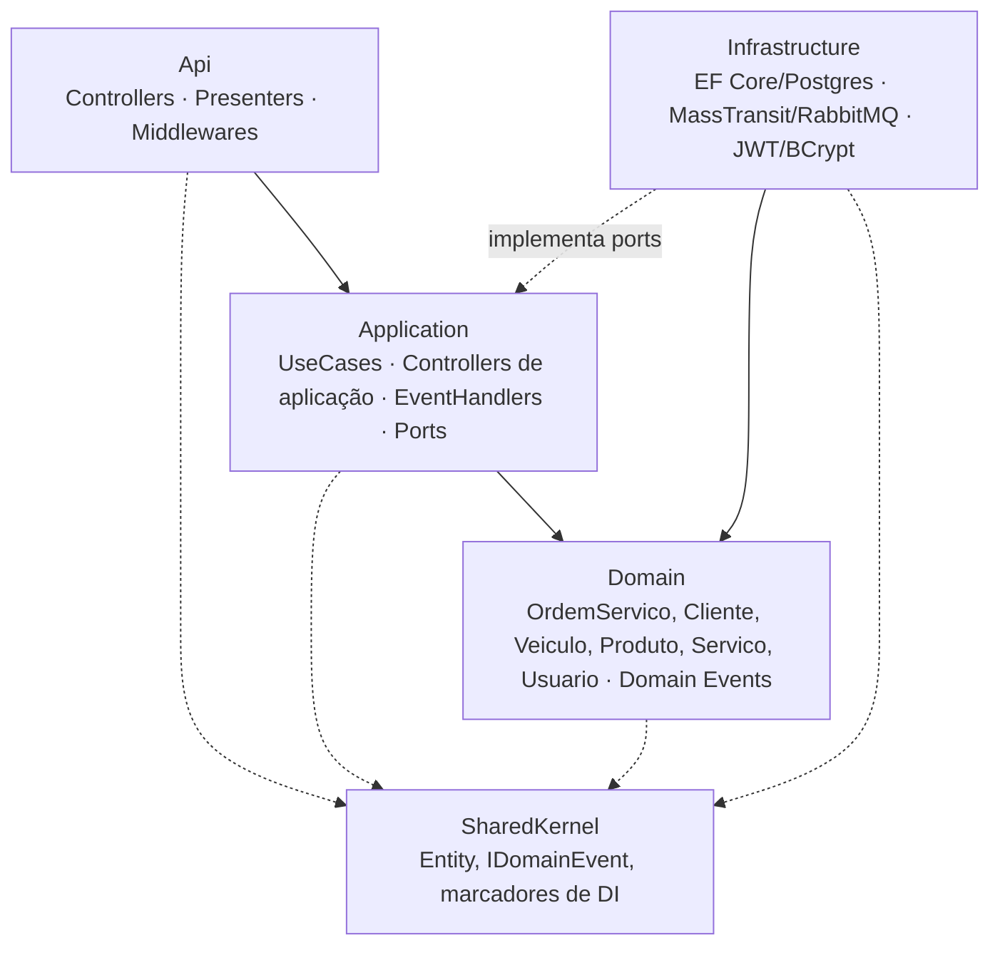
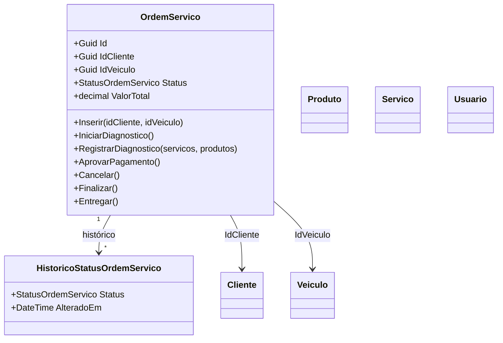
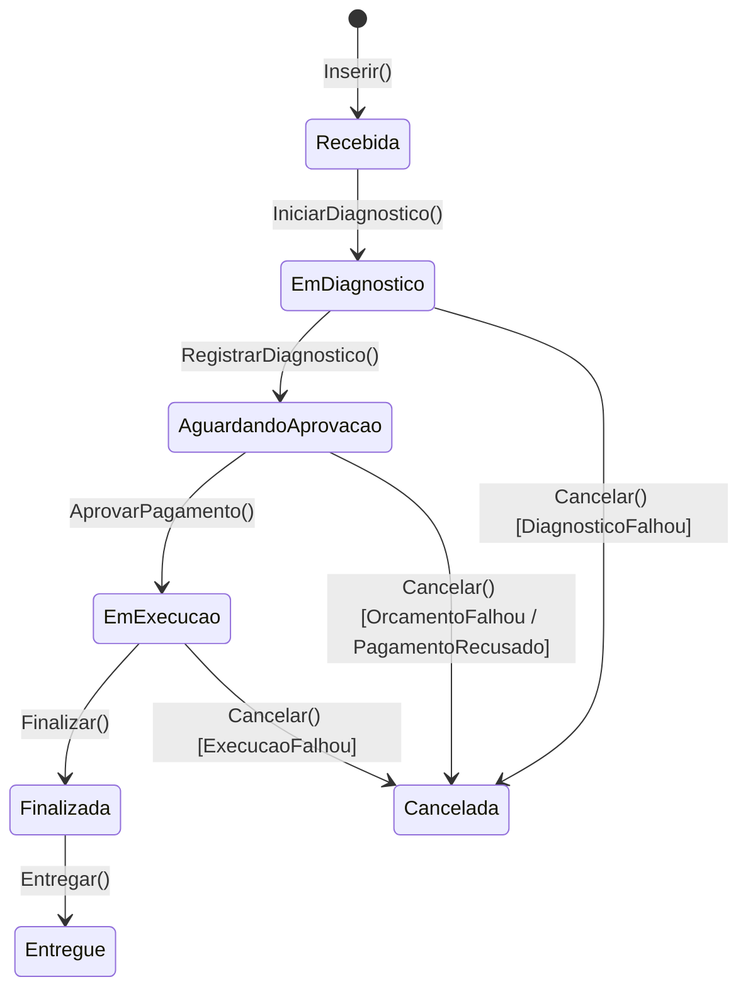
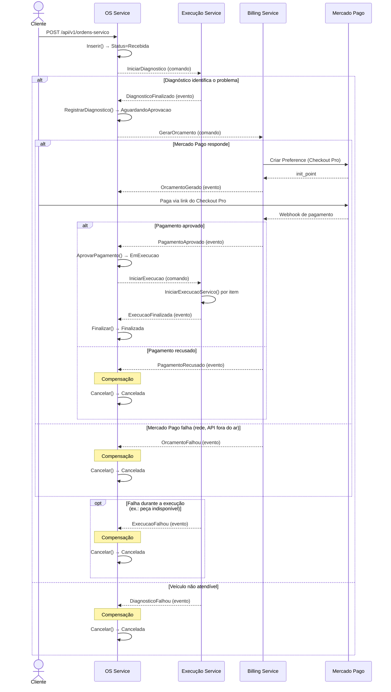

# Arquitetura — OS Service

Documento complementar ao [README](../README.md), com mais profundidade sobre camadas,
modelo de domínio e o fluxo completo da saga (incluindo compensação). Decisão de design
específica (por que orquestração sem saga state machine separado): [ADR 0001](./adr/0001-saga-orquestrada-sem-state-machine-separado.md).

## Camadas (Clean Architecture)

Setas cheias = dependência de compilação. Setas pontilhadas = implementação de
interface (Infrastructure nunca é referenciada por Application/Domain — a regra é
garantida por testes de arquitetura, NetArchTest, em `tests/Tests/Camadas`).

## Modelo de domínio

`OrdemServico` é o único agregado que participa da saga — os demais (`Cliente`,
`Veiculo`, `Produto`, `Servico`, `Usuario`) são cadastro/catálogo, sem máquina de
estados distribuída.

### Máquina de estados de `OrdemServico`

`Cancelada` é alcançável a partir de qualquer estado não-terminal — é o único estado
de compensação da saga (ver seção seguinte).

## Fluxo completo da saga (com compensação)

Os 4 caminhos de compensação (`DiagnosticoFalhou`, `OrcamentoFalhou`,
`PagamentoRecusado`, `ExecucaoFalhou`) convergem todos no mesmo `CancelarUseCase` —
tabela completa e justificativa de design no [ADR 0001](./adr/0001-saga-orquestrada-sem-state-machine-separado.md).

## Mensageria — comandos e consumers

| Mensagem | Tipo | Direção | Consumer/Handler |
|---|---|---|---|
| `IniciarDiagnostico` | Comando | OS → Execução | (consumido no Execução Service) |
| `GerarOrcamento` | Comando | OS → Billing | (consumido no Billing Service) |
| `IniciarExecucao` | Comando | OS → Execução | (consumido no Execução Service) |
| `DiagnosticoFinalizado` | Evento | Execução → OS | `DiagnosticoFinalizadoConsumer` |
| `DiagnosticoFalhou` | Evento (compensação) | Execução → OS | `DiagnosticoFalhouConsumer` |
| `OrcamentoGerado` | Evento | Billing → OS | (não consumido pelo OS hoje — informativo) |
| `OrcamentoFalhou` | Evento (compensação) | Billing → OS | `OrcamentoFalhouConsumer` |
| `PagamentoAprovado` | Evento | Billing → OS | `PagamentoAprovadoConsumer` |
| `PagamentoRecusado` | Evento (compensação) | Billing → OS | `PagamentoRecusadoConsumer` |
| `ExecucaoFinalizada` | Evento | Execução → OS | `ExecucaoFinalizadaConsumer` |
| `ExecucaoFalhou` | Evento (compensação) | Execução → OS | `ExecucaoFalhouConsumer` |

Todos os consumers são adaptadores finos: constroem o use case correspondente (o
mesmo usado pelos endpoints REST internos) e traduzem "não encontrada" em exceção
(o MassTransit trata isso como falha de entrega/retry). Nenhuma regra de negócio
vive na camada de mensageria.

## Persistência

PostgreSQL via EF Core, banco lógico `soat_os` isolado (ver README > "Banco de
dados"). Migração inicial gerada em `src/Infrastructure/Database/Migrations`. O
histórico de status (`HistoricoStatusOrdemServico`) é gravado a cada transição —
usado tanto para auditoria quanto para o endpoint `GET .../historico`.

## Segurança

Único serviço dos 3 que emite JWT (login do back-office). Os outros dois validam o
mesmo token com o segredo simétrico compartilhado — ver README > "Autenticação".
